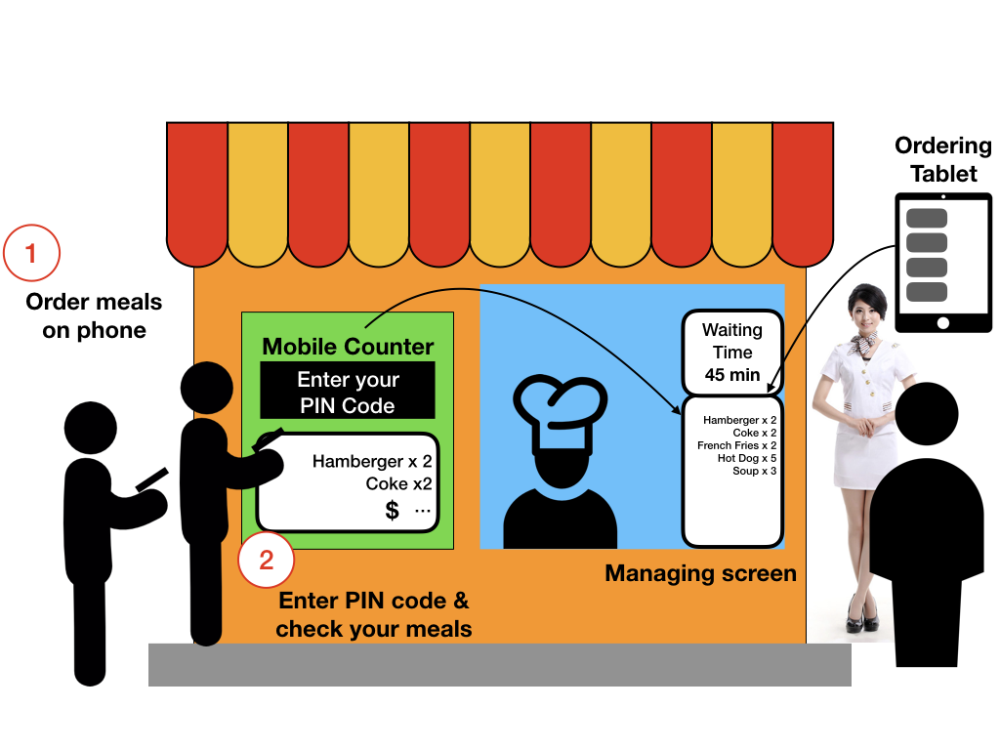
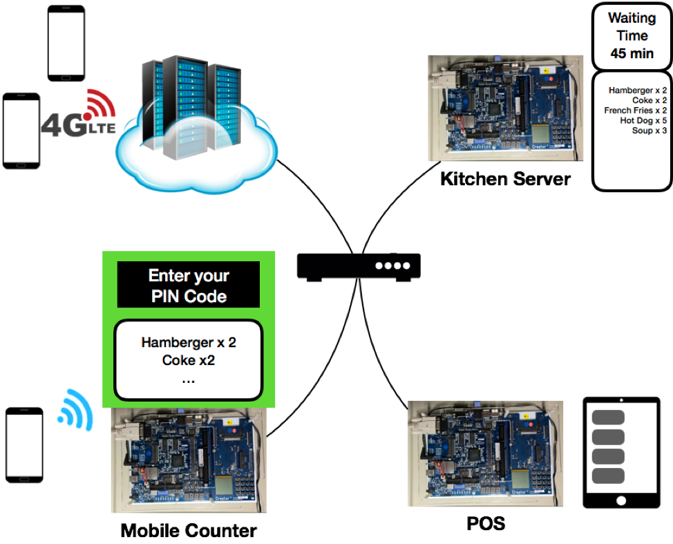
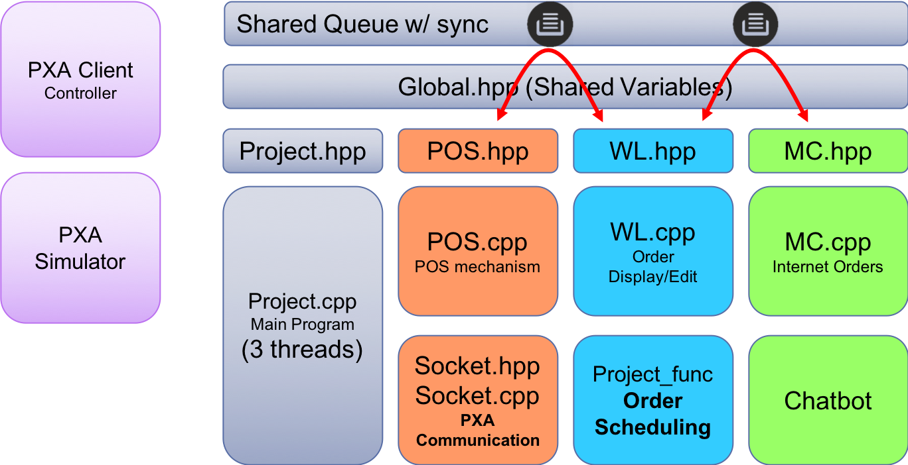

# Multi-Access Point of Sales System
## Introduction
### - A meal ordering system with multiple ordering interfaces
This is the final project of the "Embedded Operating System" course. We have built a meal ordering system to alleviate the crowded situation in the food court of our campus. To control the cost of the system, we adopted embedded system with LCD and keyboard as the I/O devices (ordering and displaying). One of the devices is used as a POS carried by a clark and entering the meals which are ordered by the customers. And another one is deployed in the kitchen for displaying the orders (Kitchen Server). This can improve the effectivity of the communication between the kitchen and waiters/waitresses. Another device is an automatic counter (Mobile Counter) for confirming the orders which are directly sent from phones, the customers who use phone to order meals need to enter the PIN code which the system reply to them. Also, we have implement a Facebook chat bot server for receiving the order from customers. The application scenario is shown bellow:

## Hardware Architecture
The system consists of three PXA270 development broads and a server. PXA270 is SoC (system on chip) with a CPU and rich peripherals (LCD, keyboard and ethernet port). The PXA270 are all connected to a router, and the communication between them is established by socket programming. The hardware architecture is shown bellow:

## Software Architecture
There are three thread working together to control the system, they are responsible for controlling the POS, Mobile Counter and Kitchen Server, respectively. A chatbot server is another program for receiving the messages from orders using FB messenger, and it will pass the orders to the thread which is responsible for the Mobile Counter. The software (system) architecture is shown bellow:

## Demo
Click [Emulator Demo] to watch the demonstraction of our system with emulator.

Click [PXA270 Demo] to watch the demonstraction of our system implemented on development broads.

[Emulator Demo]:https://youtu.be/zaPLEpnmBqA
[PXA270 Demo]:https://www.youtube.com/watch?v=Hm7lPj2G6bA&feature=youtu.be